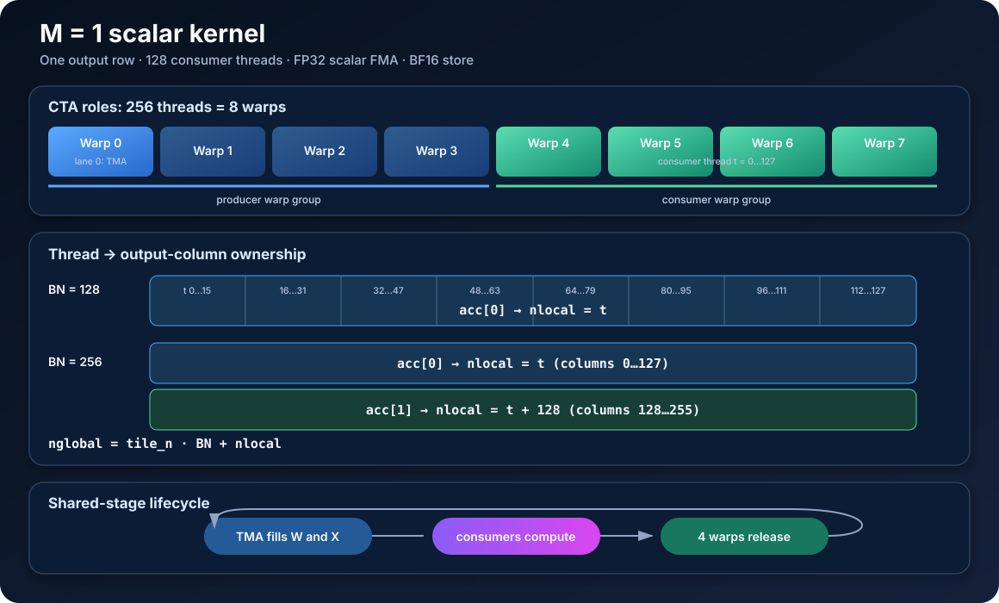
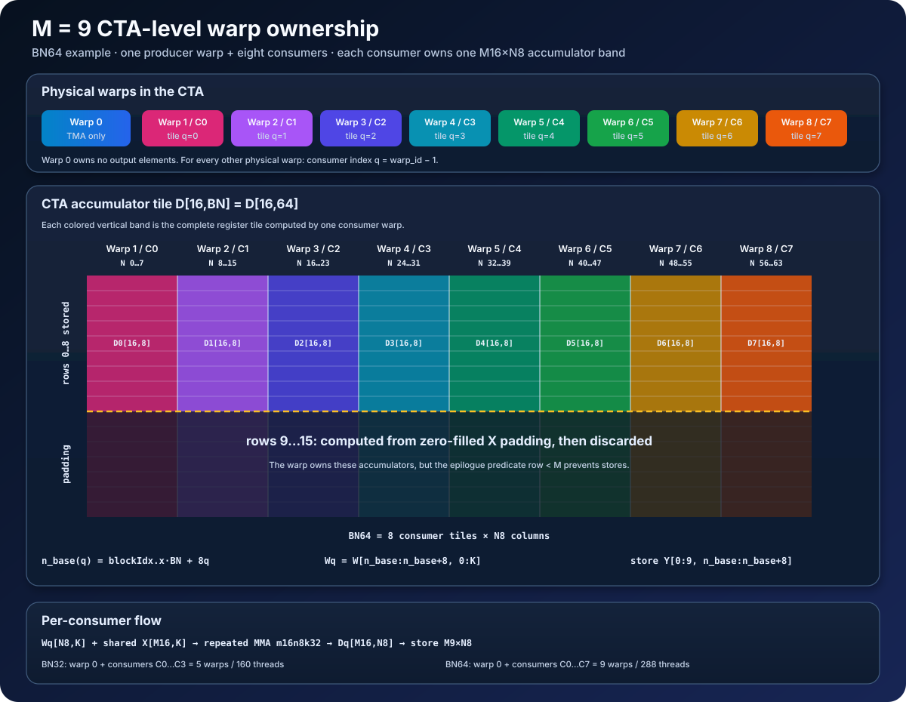
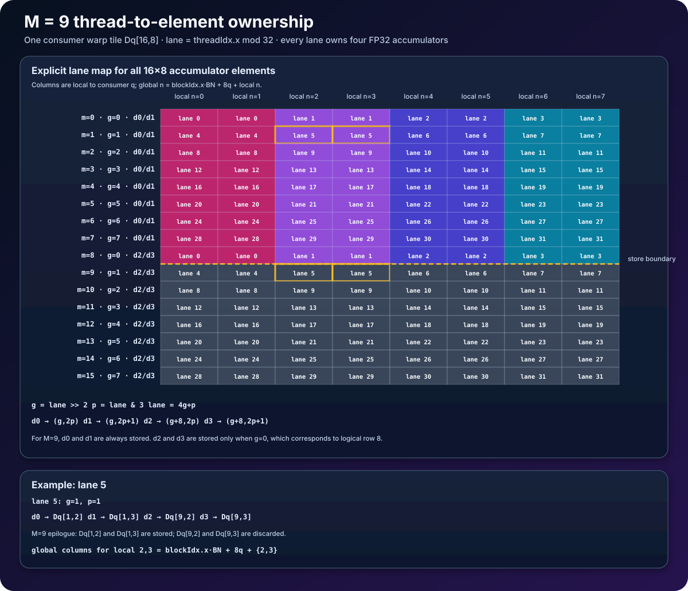

# SM120 FP8 Tiny-M GEMM: Short Design Note

## Thinking

The first question was to understand the SM120 architecture. For the SM120
FP8 path used here, TMA is asynchronous, while the compute path is warp-level
MMA rather than async warpgroup MMA. Because TMA is asynchronous, **I chose a
warp-specialized GEMM design instead of a Volta-style software-pipelined
GEMM: one warpgroup issues TMA instructions, and the remaining warps consume
the data**.

Because the epilogue is lightweight (just an elementwise multiply by alpha),
I let each consumer warp compute and apply the epilogue in place, rather than
introducing a separate cross-warp accumulation scheme.

After checking the FP8 MMA variants, I found that the smallest supported m is
16. Using m16 for the M=1 case would waste 15/16 = 93.75% of the Tensor Core
work, whereas the waste for M=9 is 7/16 = 43.75%, which is much more
acceptable. This led to the first design decision: **fall back to CUDA cores
when M=1, and use Tensor Cores when M=9**.

**The second design question is how to choose the tiling**. When I wrote GEMM
kernels for Turing and Volta, I usually used CTA tile sizes such as 128 or
256. In our case, each CTA computes an [M, BN] output tile. Therefore, **BN
mainly affects the problem decomposition in the N dimension: a smaller BN
produces more CTAs, so more SMs can be assigned work, whereas a larger BN
produces fewer CTAs, so fewer SMs receive CTAs. At the same time, BN also
contributes to the per-CTA resource footprint.**

**BK determines the per-stage footprint and therefore constrains the feasible
number of stages, since the producer warpgroup prefetches roughly
num_stages * (M + BN) * BK bytes into shared memory.**

In this small-M, large-N, large-K regime, I am not trying to maximize CTA
occupancy within an SM. Instead, I am intentionally targeting a
**one-CTA-per-SM design**; in fact, some SMs may not receive a CTA at all if
the grid is too small. Under this design point, we do not need to optimize for
multiple resident CTAs per SM, and a single CTA can use almost the full
per-block shared-memory budget. On RTX 5090 / sm_120, that means up to about
99 KB per CTA, while the total shared-memory capacity per SM is 128 KB.

**The third design question is the number of consumer warps inside a CTA and
how the work is partitioned among them**. Because M is very small, warp tiles
can only be partitioned along the N dimension. **As a result, the number of
consumer warps depends on both the choice of BN and whether the throughput of
TMA and MMA is well matched.** Ideally, within one SM, the Tensor Cores, the
MIO pipeline, and the CUDA cores should all be active at the same time.

Once the parameters above are fixed, the intra-warp logic becomes much easier
to implement. For M=9, I generally prefer Tensor Core MMA variants. For M=1,
a CVT+FMA (or GEMV-like) path may be preferable, since this regime is
typically memory-bound. For the M=9 case, if the consumer path is MMA, it is
usually more natural to use LDSM/ldmatrix, because the MMA operand layout is
designed around matrix-style loads from shared memory. Finally, the TMA
shared-memory layout, including whether to enable swizzling, should be chosen
based on the downstream compute path: swizzled layouts are typically
beneficial for MMA/LDSM consumers, but are not necessarily needed for
non-MMA consumers.

After implementing the prototype, I shared the above ideas with the agent and
asked it to explore combinations of the following parameters:
* Cuda-core/TensorCore for M=1/9.
* BN, bigger BN -> less resident CTA, but better data reuse; smaller BN ->
  more resident CTA but poor reuse.
* BK, because it determines the number of stages; a shallow pipeline exposes
  memory-access latency.
* LDSM or LDS
* number of consumer warps, 4 or 8.

I did not do any profiling or low-level performance tuning, because the best
configuration found by the agent already outperformed cuBLAS in both
fp8_gemm_task_harness.py and the C++ test I wrote.

## Trade-offs

* No Split-K, since it complicates the implementation and is unlikely to be
  beneficial in our use case.
* No CTA swizzling, since in our cases the L2 cache on the RTX
  5090 is large enough to hold both the weights and the activations.

## Shared pipeline

Both kernel families use a circular K-stage shared-memory pipeline. A producer
issues TMA transfers for X and W, while full and empty `mbarrier` objects pass
stage ownership between loading and compute. W uses rank-2 TMA with a
128-byte-swizzled layout. The swizzle matches the shared-memory fragment
addressing and avoids systematic bank conflicts. Pipeline phase bits toggle
when the ring wraps, so a stage can be reused without clearing its barriers in
the hot loop.

The output scale is applied to FP32 accumulators immediately before BF16
conversion. `prepare_weights` returns B in its original `[N,K]` layout, so
there is no model-load repacking cost or auxiliary weight allocation. The
official harness reuses one alpha tensor; the Python adapter caches its host
value after the untimed warmup, avoiding a device synchronization in the
measured path.

## M=1 scalar family

An M16 tensor-core instruction would waste 15 of 16 rows for M=1. Instead,
`FP8GemmTinyM` assigns four producer warps and four consumer warps to each CTA.
Only the producer leader issues rank-1 TMA for the single X row and rank-2 TMA
for W. Each consumer loads aligned 16-byte FP8 vectors, converts them, and
performs scalar FP32 FMAs.

At BN128, consumer thread `t` owns output column `tile_n + t`. At BN256, the
same thread owns columns `tile_n + t` and `tile_n + t + 128`, reusing every
converted X vector across two accumulators. The BK256 specialization is not
split-K: one CTA reduces the full K dimension, while each logical BK256 W tile
is delivered as two adjacent legal K128 TMA boxes into one pipeline stage.

`NUM_CONSUMER_WG=1` wins because it exactly supplies 128 consumers. For BN128,
one consumer thread computes one output element, so the first CWG covers all
128 outputs. Additional CWGs cannot expose more output-column parallelism
without intra-CTA split-K and a reduction. For BN256, CWG1 assigns two columns
to each thread and reuses every X conversion. CWG2 assigns one column per
thread but loses that reuse. CWG3 provides 384 consumers for only 256 outputs,
so its third group is masked and unnecessary while still adding synchronization
overhead. These nearly 99 KiB shared-memory CTAs are already limited to one
resident CTA per SM, so additional consumer groups do not improve CTA
residency. In the selected BN256/BK128/S3 measurement, CWG1 and CWG2 tied at
0.07497 ms while CWG3 measured 0.0756 ms; CWG1 retained the same best latency
with fewer threads and better reuse.

## M=9 tensor-core family

### Warp-level tiling

### Thread-level tiling

For M=9, using 9 of 16 tensor-core rows is worthwhile. `FP8GemmTinyMMmaM16`
uses one producer warp plus `BN/8` consumer warps. TMA requests a padded M16 X
tile and zero-fills rows 9 through 15. Each consumer warp owns one M16-by-N8
output slice. `ldmatrix` loads native shared-memory fragments and
`mma.sync.aligned.m16n8k32` accumulates into FP32 registers; only logical rows
0 through 8 are stored.

BN64 supplies eight independent N8 warp tiles for the N8192 and N5120 cases.
BN32 supplies four tiles and doubles the CTA count for N16384, improving
distribution of its larger weight stream. Pipeline depth is tuned per K and
tile footprint: S2 for BN32, S3 for the common BN64/K5120 case, and S7 for the
small-N K6144 case.
